  
   
  <h1 style="font-size: 3rem; margin-bottom: -10px;">ROHIT NAIK</h1>
  
  

    ENGINEERING UNDERGRADUATE &ensp;|&ensp; COMMUNITY ARCHITECT &ensp;|&ensp; GOOGLE STUDENT AMBASSADOR
  

  

    "Bridging the gap between algorithmic complexity and scalable community ecosystems."
  

  

    
    
    
    
  

 

---

## ⚡ The Value Proposition

> [!NOTE]
> **Why I Exist:** Most emerging engineers focus solely on syntax. I focus on the intersection of **technical execution** and **developer advocacy**. I don't just write code; I cultivate the environments where code thrives.

| **The Standard Trajectory** 📉 | **The Rohit Protocol** 🚀 |
| :--- | :--- |
| **Passive Consumer:** Follows tutorials. | **Active Builder:** Architects scalable web apps. |
| **Siloed Learning:** Studies in isolation. | **Community Multiplier:** Leads GFG & Google cohorts to elevate peer learning. |
| **Theory First:** Memorizes syntax. | **Deployment First:** Focuses on shipping, cloud infra (GCP), and DSA optimization. |

 

## 🧠 The Internal Engine

This is how I process problems and deliver value to the tech ecosystem:

```mermaid
graph LR
    A[Input: Complex Problem] -->|Analyze| B(DSA Optimization Strategy);
    B -->|Language Selection| C{C++ or Python?};
    C -->|Performance| D[C++: Low-Level Logic];
    C -->|Scalability| E[Python: Web Architecture];
    D & E -->|Deployment| F[Scalable Solution];
    F -->|Distribution| G[Community Knowledge Transfer];
    
    style A fill:#1e1e1e,stroke:#333,stroke-width:2px
    style G fill:#4285F4,stroke:#4285F4,stroke-width:2px,color:#fff



```

 

## 🛠️ Technical Arsenal

I treat my skills as atomic units that can be combined to solve complex problems.

### **Core Competencies**

* **Algorithmic Efficiency:** Leveraging **C++** for memory management and high-performance computing tasks.
* **Rapid Prototyping:** Utilizing **Python** to build scalable backend logic and automate workflows.
* **Cloud Fluency:** Active **Google Cloud Arcade Facilitator**, managing cloud resources and deployment pipelines.
* **Community Engineering:** Proven ability to mobilize students via **Unstop** and **GFG** initiatives.

> [!IMPORTANT]
> **Metric of Success:** Currently leading technical culture at SSPM COE, directly impacting the learning curve of peers through workshops and resource distribution.

 

## 🗺️ The Roadmap (2025-2026 Vision)

| Status | Milestone | Vision |
| --- | --- | --- |
| 🟢 | **DSA Mastery** | Solving 500+ LeetCode/GFG problems to master optimization. |
| 🟡 | **Full-Stack Pivot** | Building a MERN stack application for campus resource management. |
| 🟡 | **Open Source** | Making first major contribution to a top-tier repo. |
| 🔴 | **Hackathon Win** | Leading a team to victory in a national-level Smart India Hackathon. |

 

## 🤝 Connect & Collaborate

I am open to collaborations on **Open Source**, **EdTech tools**, and **Hackathons**.

# Clone my digital identity
git clone [https://github.com/rohit-naik/collaboration.git](https://github.com/rohit-naik/collaboration.git)

# Contact Interface
const contactInfo = {
  email: "connect@rohitnaik.dev", // Reach out via email
  linkedin: "[https://linkedin.com/in/YOUR_PROFILE](https://linkedin.com/in/YOUR_PROFILE)",
  github: "[https://github.com/rohit-naik](https://github.com/rohit-naik)"
};

console.log("Let's build something scalable.");

<strong>🔻 Click to view Academic Credentials</strong>

 
<ul>
<li><strong>Institution:</strong> SSPM College of Engineering (SSPM COE)</li>
<li><strong>Degree:</strong> B.E. Computer Engineering (1st Year)</li>
<li><strong>Focus:</strong> Data Structures, Algorithms, Web Engineering</li>
</ul>

  
  

